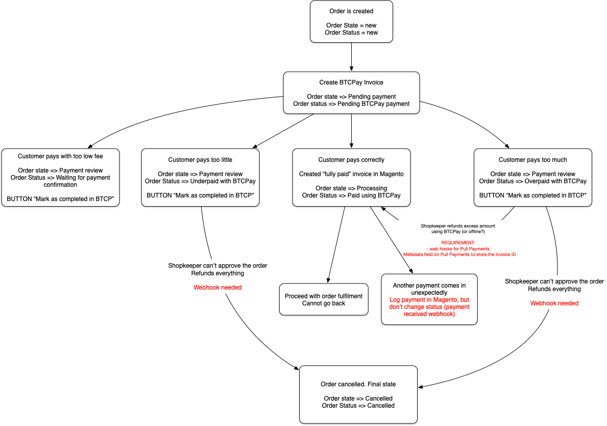

# BTCPay Server integration for Magento 2

## Requirements
- BTCPay Server supported versions: >=1.3.0 (including >=2.0.0)
- Magento 2.4.2 or later installation (tested on Community Edition 2.4.6-p6)
- Magento < 2.4 should also work, but is untested
- PHP 8.0 or greater. Tested with PHP 8.2
- Your BTCPay Server must be setup with HTTPS or HTTP using TOR for security
- You need an API key for your user in BTCPay Server (new since module v2.0)
- Single-Store Mode is not supported

## Features
- Allows you to pay with BTCPay Server in Magento 2 stores
- Magento receives invoice updates and updates the order statuses through webhooks
- Custom order statuses in Magento are supported
- View BTCPay Server invoices created in Magento Admin
- Magento also polls for invoice updates as a safety net for when real-time updates didn't reach Magento
- Multi-website and multi-store compatible
- Creating an API key is easy through the use of the Greenfield API authorize URL 

## Goal
The goal of this module is to allow Bitcoin payments in Magento 2 without any other 3rd party.
This module is also designed to be robust, low-maintenance and a solid foundation for future customization, should your business need it.

## How to install

The installation process is just like any other Magento 2 module that you'd install using composer. For your reference, these are the typical steps:

- Add the `Storefront_BTCPay` module using composer by running:
```
composer require btcpayserver/magento2-btcpay-module
```
- Enable the new module
```
php bin/magento module:enable Storefront_BTCPay
```
- Run the installation script of the new module
```
php bin/magento setup:upgrade
``` 

## How to configure
After installation, a new Payment Method will be visible in Stores > Configuration > Sales > Payment Methods. Configure the fields there.

You will need to enter your BTCPay Server API key.

## How does it work?
- When an order is placed in Magento and BTCPay Server was selected as a payment method, the customer is redirected to the payment page on your BTCPay Server.
- The customer can pay there, or he can cancel his order.
- When he cancels, the unpaid order is canceled freeing up reserved stock and the customer is sent back to the shopping cart page. This module will restore the contents of the shopping cart, so the customer does not need to start from scratch.
- When the customer pays, BTCPay Server will be notified of the payment and will signal Magento on the changed invoice status.
- BTCPay Server pushes payment status changes to Magento, but Magento can also poll for invoice changes on it's own. We've built this as a safety net in case BTCPay Server cannot connect to Magento (i.e. during developement, behind a firewall).
- Invoice updates from BTCPay Server to Magento are instant.
- Magento polls BTCPay Server for updates every 5 minutes.

## What does the order status flow look like?


 
## Which payment methods are supported?
This depends on your configuration of BTCPay Server. All payment methods you have activated on BTCPay Server, will be available to the customer.

## What isn't supported?
- Only 1 domain name can be configured for BTCPay Server, so you cannot have multiple BTCPay Servers. The one is used for the whole Magento installation.
- Refunds cannot be handled from within Magento (coming in the future)
- Orders that are underpaid, overpaid or paid with a too low fee get the status "Payment Review" so they can be checked manually.

## What's new in this module v2?
This module v2 now uses BTCPay Server's new Greenfield API and no longer relies on the old BitPay PHP API. By making this switch, we are opening ourselves up to future improvements.
For you as a shopkeeper, it means that you'll need to configure an API key in Magento (create it in BTCPay Server, then enter it in Magento config). The original pairing process has been removed.

## Who has created this module?
This module was created by Storefront, a small Magento integrator from Belgium with over 12 years of Magento experience. Visit our website at https://www.storefront.be to learn more about us.

This module does NOT contain any advertising, is 100% open-source and free to use.

## Why did you create this module?
- Existing modules had very poor code quality, did not follow Magento 2 best-practises
- Was little supported (in combination with BTCPay Server)
- Was confusing to set up since the previous modules are basically designed for BitPay
- We now have a module dedicated to BTCPay, so both BTCPay Server and this module can innovate freely without having to consider BitPay compatibility
- Higher code quality means less maintenance and easier compatibility with future Magento versions

## What can I do if my BTCPay Server or Magento was offline for some time and invoice updates may not have synchronized?
Magento polls BTCPay Server every 5 minutes for updates to non-complete invoices, so basically you don't need to do anything. This is handled by a cronjob.
If you don't want to wait 5 minutes or prefer to see what is happening, we have prepared a console command to run the invoice sync manually:

```
bin/magento btcpay:invoice:update
```

## Can I pair from the command line?
Pairing was the old way of linking this module to your BTCPay Server and is no longer needed. Instead, just enter your API key in Stores > Configuration > Sales > Payment Methods.

## What is the future roadmap?
- Handling refunds from within Magento
- Support for configuring multiple BTCPay Servers, so you can have separate installations for different websites/stores (low priority).
- Nothing else is required really, as this module does what it needs to do in a robust and dependable way.

## What if I need help?
Just like with any other open source software, you can get help anywhere from the community, or just open an issue here on Github.

You can talk to Wouter Samaey on the BTCPay Server Mattermost #development channel or if you prefer professional paid support, you can contact Storefront at info@storefront.be.

If this module powers your business, consider getting paid support and also donate to the development of BTCPay Server at https://btcpayserver.org/#makeADonation
